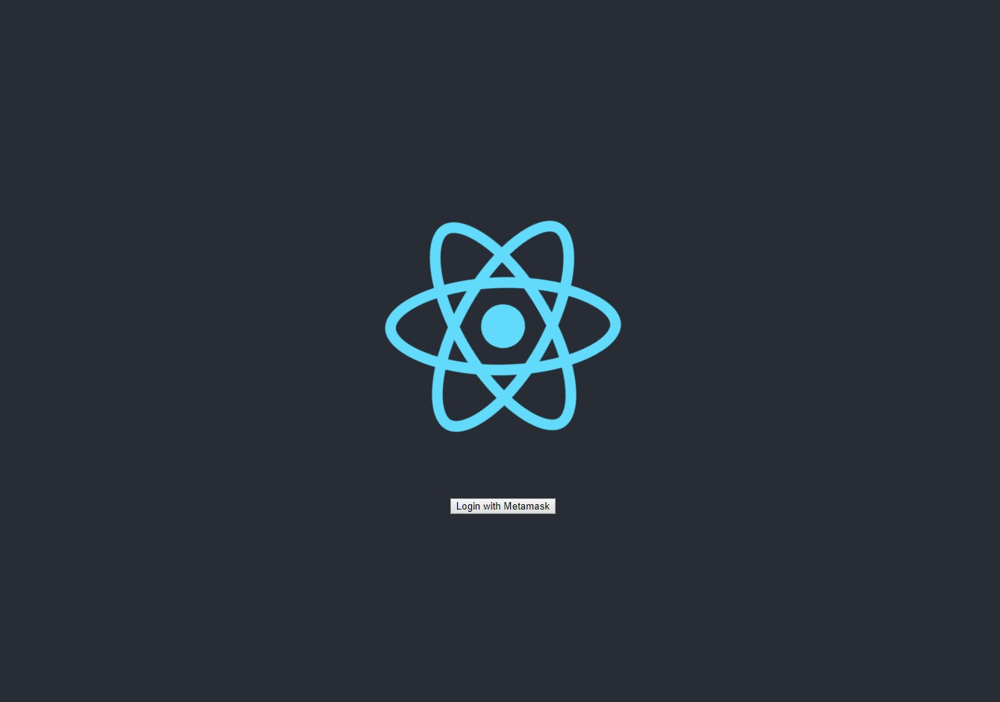

## Modular 24-2019

# react context with web3

A React app with a single Web3 instance held globally using React Context.

## 1. Preview




## 2. Getting Started

### 2.1 Install

Install dependencies for the React Client.

```
cd client
yarn || npm install
```


### 2.2 Run

Run the client. In `./client`:

```
yarn start || npm run start
```
